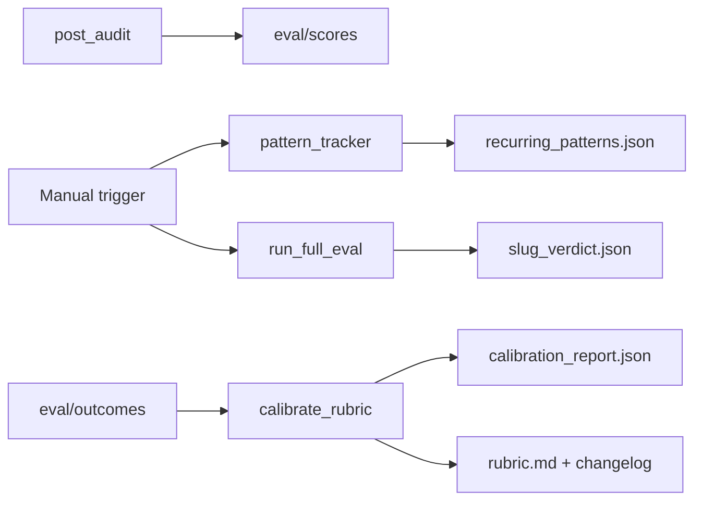

# Eval autonomy loop (≤1 page)

## What runs automatically (after each audit)

1. **Structural eval** — `python eval/eval.py reports/{store}.md` via `post_audit.py`. Parses experiments, validates confidence (0–100), lift ranges, numeric decision rules, executive prose, table row counts. No API keys.
2. **Grounded checks (required before write)** — `eval/grounded.py` → `artifacts/{slug}/tech_grounded.json`. PSI 429 → Warn `rate limited`. Never fake Pass in the report.
3. **Cross-audit** — `eval/cross_audit.py` when both gingerpeople and zenrojas reports exist; flags `eval_generalization_gap` if deltas ≥3.

## What runs manually (when you ask)

No cron — trigger these yourself or tell the agent to run them.

| Command | Purpose |
|---------|---------|
| `python eval/run_full_eval.py {slug}` | Full loop: structural + grounded + pattern tracker + cross-audit + judge verdict |
| `python eval/pattern_tracker.py` | Recurring vs one-off flags → `recurring_patterns.json` |
| Edit `eval/outcomes/*.json` then `python eval/calibrate_rubric.py` | Outcome-driven rubric suggestions → `calibration_report.json` |
| Apply + log | Edit `eval/rubric.md`, entry in `eval/rubric_changelog.md` |

**Human-only input:** `eval/outcomes/` — merchant experiment results (shipped, lift, quality scores at audit time).

**Optional LLM:** Judge + challenger via `skills/evaluate.md` + `eval/rubric.md` → `{slug}_judge.json`, `{slug}_debate.json`. Then re-run `run_full_eval.py` for `{slug}_verdict.json`.

## Self-improvement flow

## Rubric versioning

`eval/rubric.md` + `eval/rubric_changelog.md`. Every human correction is a commit with a reason. **Git history is the eval system's learning history.**

## Dual-LLM challenger

When the judge scores any dimension or experiment ≥7, the challenger re-reads the same citation and argues ≤5. Gap ≥2 → `human_review: true` in `{slug}_verdict.json`. Over time, disagreements patch the rubric.

## Truth hierarchy (most → least trusted)

1. **Experiment outcome data** — `eval/outcomes/` (market truth).
2. **Grounded checks** (SSL, sitemap, PSI when available).
3. **Judge + challenger consensus** (both agree → high confidence).
4. **Human spot-check** — bootstrap only.

## Month 1–3 (operating model — manual triggers for now)

| Month | Behavior |
|-------|----------|
| **1** | `post_audit.py` after every audit; run `pattern_tracker` when flags cluster; humans review debate items. |
| **2** | `calibrate_rubric.py` after outcome updates; patch `rubric.md` + changelog. |
| **3** | Rubric patches flow into `skills/reason.md` evidence rules; outcome data weights hypothesis scoring. |

## Vector / embeddings at scale (not in this repo)

~7 pages per store in `artifacts/` — **no vector DB**. At thousands of audits, embed experiment paragraphs and rubric patches for cross-merchant pattern mining (Month 3+).
