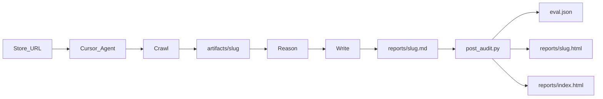

# Qosmic Runtime Audit Harness

Agent-native harness that turns any coding agent into a Qosmic storefront audit agent.

**Start here:** open [`index.html`](index.html) in a browser — this is the **project overview dashboard** 
(live workflow diagram, architecture summary, links to all audit reports and eval scores). 
It lives in the repo root so GitHub Pages can serve it directly without a build step.

> **[5-min video walkthrough →](https://youtu.be/KejKZ0n7om0)**

> Assignment deliverable folder is named `reports/` (assignment text says `sample_output/`; same role).

## Architecture



## Quick start

1. Open this repo in **Cursor Agent** mode.
2. One prompt runs crawl → report → eval → HTML:

   ```
   Qosmic audit: https://zenrojas.com
   ```

   Crawl runs `discover_store.py` (text + **required screenshots** for all 7 surfaces). Agent completes Reason → grounded → Write → `post_audit.py`. Do not read `target_report.md`.

3. Outputs:
   - `artifacts/{store}/` + `manifest.json`
   - `reports/{store}.md` (canonical)
   - `reports/{store}.html` (from template, no LLM tokens)
   - `eval/scores/{store}.json`
   - `reports/index.html` when both stores are audited
  

## Screenshots


## Crawl helpers

```bash
pip install -r requirements.txt
python scripts/discover_store.py https://gingerpeople.com
python scripts/refresh_manifest.py gingerpeople
```

## PageSpeed Insights API key

Grounded checks call the PSI API for mobile/desktop scores.

1. Copy `.env.example` → `.env`
2. Set `PAGESPEED_API_KEY` (or `GOOGLE_PSI_API_KEY`) from [Google Cloud Console](https://console.cloud.google.com/apis/credentials) with PageSpeed Insights API enabled
3. `.env` is gitignored — never commit the key

```bash
python eval/grounded.py --url https://zenrojas.com --out artifacts/zenrojas/tech_grounded.json
```

## Expected runtime

| Phase | Typical time |
|---|---|
| Crawl + screenshots (`discover_store.py`) | ~1–2 min |
| Grounded checks (`grounded.py`, PSI mobile + desktop in parallel) | ~1–2 min |
| Agent reason + write report | ~5–15+ min (varies) |
| Post-audit (`post_audit.py`) | ~10s |

PSI mobile and desktop run in parallel. 

## Post-audit (automatic in harness)

```bash
python scripts/post_audit.py zenrojas
```

Runs structural eval, cross-audit (if both reports exist), HTML render, and dashboard.

## Other scripts

| Script | Purpose |
|--------|---------|
| `scripts/render_report.py` | MD → HTML (no LLM) |
| `scripts/check_evidence.py` | Verify artifact + screenshot paths in report |
| `scripts/capture_screenshot.py` | Playwright PNG capture (full page or element selector) |
| `eval/render_dashboard.py` | `reports/index.html` scoreboard |
| `eval/run_full_eval.py` | Full eval loop + verdict (manual) |
| `eval/pattern_tracker.py` | Recurring vs one-off flags (manual) |
| `eval/calibrate_rubric.py` | Rubric suggestions from outcomes (manual) |

## Self-improvement (manual)

After audits, `post_audit.py` runs automatically. The **learning loop** is manual — run when you want it: (In production has to be run in intervals)

```bash
python eval/run_full_eval.py gingerpeople    # full loop + verdict JSON
python eval/pattern_tracker.py                 # systemic vs store-specific flags
python eval/calibrate_rubric.py                # after editing eval/outcomes/*.json
```

Log accepted rubric changes in `eval/rubric_changelog.md`. See `EVAL_LOOP.md` and `eval/outcomes/README.md`.

## Screenshot evidence (required — part of every audit)

`discover_store.py` captures full-page PNGs for all 7 surfaces under `artifacts/{slug}/screenshots/`. Reports must cite them in every experiment **Evidence** line. HTML embeds them via `render_report.py`.

Re-capture only:

```bash
python scripts/capture_audit_screenshots.py zenrojas
```

See `skills/crawl.md`.

## Layout

- `AGENTS.md` — entry contract
- `skills/` — crawl, reason, write, evaluate (includes optional judge)
- `reports/` — final audits (.md + .html)
- `artifacts/` — crawl outputs
- `eval/` — scorer, grounded checks, cross-audit, self-improvement scripts
- `eval/outcomes/` — **human-entered** merchant experiment results
- `EVAL_LOOP.md` — autonomy plan

## Test URLs

- Calibration: https://gingerpeople.com
- Generalization: https://zenrojas.com


## Qualitative judge (optional)

```
Read eval/rubric.md and skills/evaluate.md (Optional: Qualitative judge). Judge then challenger reports/gingerpeople.md
```
